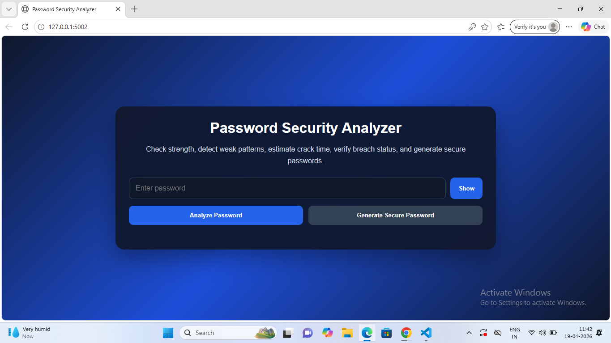
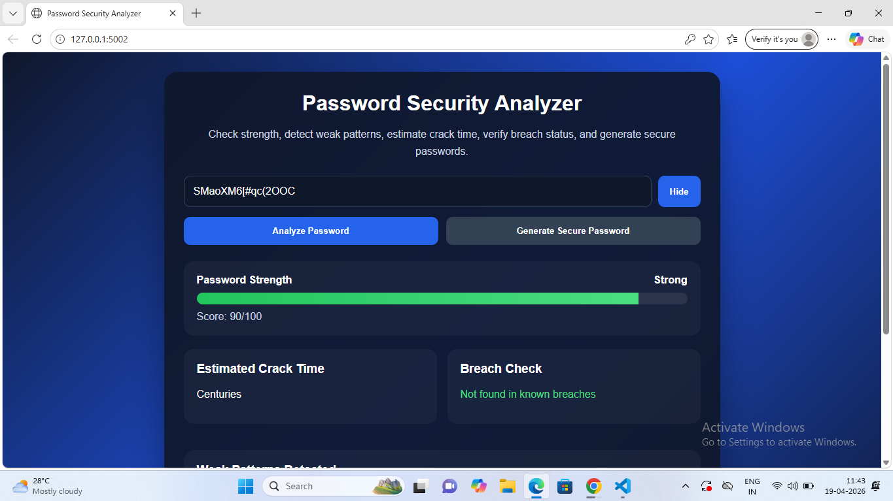

# 🔐 Password Security Analyzer

A modern **Flask-based Password Security Analyzer** that evaluates password strength, detects weak patterns, estimates crack time, checks for data breaches, and generates secure passwords.

---

## 🚀 Features

* 🔍 **Password Strength Meter** (Weak / Medium / Strong)
* ⚠️ **Weak Pattern Detection**

  * Common passwords
  * Repeated characters
  * Sequential patterns (1234, qwerty)
* ⏳ **Estimated Crack Time**
* 🌐 **Breach Detection**

  * Uses **Have I Been Pwned API (k-anonymity)**
* 💡 **Smart Suggestions**

  * Improve weak passwords instantly
* 🔑 **Secure Password Generator**
* 🎨 **Modern UI Dashboard**

---

## 🛠️ Tech Stack

* **Backend:** Python (Flask)
* **Frontend:** HTML, CSS, JavaScript
* **Libraries:** requests
* **Security:** SHA-1 hashing (k-anonymity model)

---

## 📸 Screenshots

### 🔹 Home UI


### 🔹 Password Analysis Result



---

## ⚙️ Installation & Setup

```bash
# Clone the repository
git clone https://github.com/barmandb/password-analyzer.git

# Navigate into project
cd password-analyzer

# Install dependencies
pip install -r requirements.txt

# Run the application
python app.py
```

---

## 🌐 Usage

Open in browser:

```
http://127.0.0.1:5002
```

* Enter a password
* Click **Analyze**
* View:

  * Strength score
  * Weak patterns
  * Crack time
  * Breach status
* Generate a strong password using **Generate Button**

---

## 🔐 Security Concepts Used

* Password entropy & complexity analysis
* Pattern detection (dictionary + regex)
* SHA-1 hashing
* k-anonymity API model
* Secure password generation

---

## 📂 Project Structure

```
password-analyzer/
│
├── app.py
├── requirements.txt
├── .gitignore
├── README.md
│
├── templates/
│   └── index.html
│
├── static/
│   └── style.css
│
└── screenshots/
    ├── home.png
    └── result.png
```

---

## 💼 Resume Description

Developed a **Password Security Analyzer** using Flask that evaluates password strength, detects weak patterns, estimates crack time, and checks breach exposure using the Have I Been Pwned API, along with a secure password generator and modern UI dashboard.

---

## 🔥 Future Improvements

* User login + history tracking
* Export report (PDF/JSON)
* Real-time strength indicator
* Dark/light theme toggle

---

## 👨‍💻 Author

**Dibyendu Barman**
